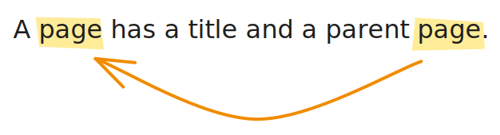

# Recursion

---

## Problem

Generate a breadcrumb trail for any page.


---

## Data

```java
class Page {
    String title;
    Page parent;
}
```

What's special about this definition?

---

## Page is defined in terms of itself



---

## Recursive data

Data that references itself:

- On Reddit, a **comment** can have a reply, which is a **comment**.
- In a file system, a **directory** can contain files and
  **directories**.
- A Git **commit** can have a parent **commit**.
- An HTML **element** can have child **elements**.

---

## Why is it important?

Because the structure of the data suggests the structure of the
solution: **recursive data** suggests **recursive functions**.

---

## Recursive function

A function that calls itself.

---

## Back to our problem

```java
class Page {
    String title;
    Page parent;

    Page(String title, Page parent) {
        this.title = title;
        this.parent = parent;
    }

    String trail() {
        // TODO: recursion
    }
}
```

---

## Expectations

```java
Page home = new Page("Home", null);
home.trail();
// => "Home"

Page departments = new Page("Departments", home);
departments.trail();
// => "Home > Departments"

Page compSci = new Page("Computer Science", departments);
compSci.trail();
// => "Home > Departments > Computer Science"
```

Can you spot a pattern?

---

## Two cases

The value of `parent` can either be

1. `null` (if it's the homepage), or a
2. `Page` instance.

---

## Case #1

If it's the **homepage**, the trail shows only the **title**:

```java
Page home = new Page("Home", null);
home.trail();
// => "Home"
```

---

```java
class Page {
    ...

    String trail() {
        // base case
        if (parent == null) {
            return title;
        }
    }
}
```

---

## Case #2

Otherwise, the trail shows the **parent's trail** plus the **title**:

```java
Page departments = new Page("Departments", home);
departments.trail();
// => "Home > Departments"

Page compSci = new Page("Computer Science", departments);
compSci.trail();
// => "Home > Departments > Computer Science"

Page apply = new Page("Apply", compSci);
apply.trail();
// => "Home > Departments > Computer Science > Apply"
```

---

```java
class Page {
    ...

    String trail() {
        if (parent == null) {
            return title;
        }

        // recursive case
        else {
            return parent.trail() + " > " + title;
        }
    }
}
```

---

## Step-by-step evaluation

```java
compSci.trail();
```

```java
departments.trail() + " > Computer Science";
```

```java
home.trail() + " > Departments" + " > Computer Science";
```

```java
"Home" + " > Departments" + " > Computer Science";
```

```java
"Home > Departments > Computer Science";
```

---

## How to write recursive functions

1. Define the **base case**: simplest version of the problem.
2. Define the **recursive case**: step towards the base case.

---

## Exercise

An organization has employees. Each employee has a name, and may be
managed by another employee. Implement a program that computes the depth
of a given employee in the organization chart. For instance, the CEO has
a depth of 0, a vice-president has a depth of 1, etc.

---

## Steps to follow

1. Define the data.
2. Write down examples.
3. Implement the base case.
4. Implement the recursive case.

---

## Extra

Some employees manage others, and some don't. How could you use
inheritance to reflect that?
